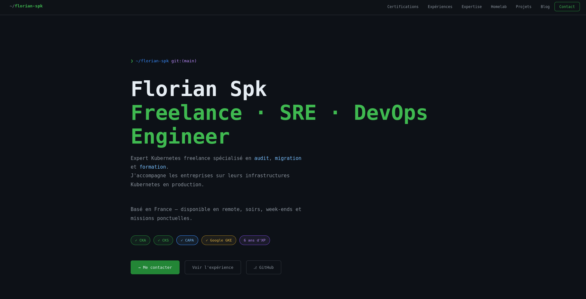

# 🧑‍💻 Personal Portfolio

> Mon portfolio personnel, déployé automatiquement avec ArgoCD et Docker, contenant mes projets, expériences et liens professionnels.

---

| CI/CD | ArgoCD | Docker | Helm |
|-------|--------|--------|------|
|  |  |  |  |

---

## 🌐 Aperçu

---

## 🚀 Stack technique

- **Frontend**: HTML / CSS / JS (static site)
- **Docker**: Image publiée sur GHCR
- **CI/CD**: GitHub Actions (build + push)
- **Helm Chart**: Pour le déploiement Kubernetes
- **ArgoCD**: GitOps pour le déploiement automatique
- **Ingress NGINX**: Pour l'exposition HTTP(S)

---
